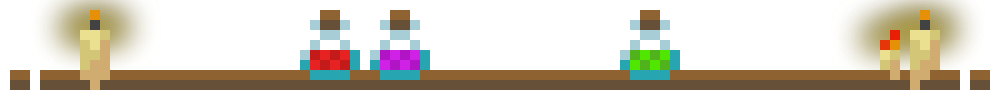

# Potions & Rituals

A Fabric mod that **reinvents alchemy** in Minecraft.

New potions, effects, alchemical stones, imbued weapons, rituals, and immersive mechanics — **alchemy becomes strategic**, expanding far beyond simple brewing

## Overview

> The Alchemist is no longer just a potion brewer,  
> but a craftsman capable of **shaping matter, life, and death**.  
> Explore a complex potion system where every ingredient has meaning,  
> and your creations can change the world… literally.

### Main Features
- **40+ new potions** with unique gameplay effects.
- **New status effects.**
- **Alchemical Stones**: apply effects to the **terrain**.
- **Brewing Cauldron**: mix up to 3 potions into one multi-effect brew.
- **Imbued Weapons**: apply a potion effect for a **number of hits**.
- **Potion-infused food**: consume enchanted meals to gain effects.
- **Stackable potions** up to 16 units.
- **Lava buckets** can fuel brewing stands (less efficient than blaze powder).
- **Rituals**: data-driven pattern-based transmutations.
- **5 in-game alchemical tomes** with recipes, lore, and illustrations.
- **Pocket Dimension** and **Spirit Dimension** to explore.
- **Fully configurable** via YACL + ModMenu.

## ⚠️ SPOILERS ⚠️

<strong>Overview</strong>

## Potions

Every potion starts with an **Awkward Potion** unless stated otherwise.  
**Redstone** → extended duration.  
**Glowstone Dust** → increased potency.

### Vanilla Potions — Alternative Recipes

| Potion          | Alternative Ingredient | Base         |
|-----------------|------------------------|--------------|
| Awkward         | Materia Prima          | Water Bottle |
| Fire Resistance | Magma Block            | Awkward      |
| Regeneration    | Golden Apple           | Awkward      |
| Strength        | Firework Star          | Awkward      |
| Poison          | Poisonous Potato       | Awkward      |
| Poison          | Poisonous Carrot       | Awkward      |
| Poison          | Poisonous Beetroot     | Awkward      |

### Mod main potions

| Potion           | Base                      | Ingredient             | Variant      |
|------------------|---------------------------|------------------------|--------------|
| Saturation       | Awkward                   | Beetroot               | Long, Strong |
| Long Legs        | Awkward                   | Bamboo                 | Long         |
| Love             | Awkward                   | Poppy                  | Long         |
| Liquid Walker    | Awkward                   | Lily Pad               | Long, Strong |
| Haste            | Awkward                   | Claw                   | Long, Strong |
| Mining Fatigue   | Haste                     | Fermented Spider Eye   | Long, Strong |
| Cold             | Awkward                   | Snowball               | Long         |
| Frost            | Cold                      | Snowball               | Long         |
| Adhesion         | Awkward                   | Resin Clump            | Long         |
| Teleportation    | Awkward                   | Ender Pearl            | Strong       |
| Thorns           | Awkward                   | Cactus                 | Long, Strong |
| Purification     | Awkward                   | Milk Bucket            | Long         |
| Alcohol          | Awkward                   | Sweet Berries          | Long, Strong |
| Berserk          | Awkward                   | Torchflower            | Long, Strong |
| Giant            | Awkward                   | Bone Meal              | Long, Strong |
| Dwarf            | Giant                     | Fermented Spider Eye   | Long, Strong |
| Photosynthesis   | Awkward                   | Leaf Litter            | Long, Strong |
| Magnetism        | Awkward                   | Iron Ingot             | Long, Strong |
| Ghost Walk       | Awkward                   | Ghast Tear             | Long         |
| Brain Washing    | Awkward                   | Zombie Brain           | Long         |
| Hands Bound      | Brain Washing             | Rabbit Foot            | Long         |
| Resurrection     | Awkward                   | Totem of Undying       | —            |
| Death            | Resurrection              | Wither Rose            | —            |
| Double Health    | Strong Healing            | Golden Apple           | Strong       |
| Ore Sense        | Night Vision              | Iron Ore               | Long, Strong |
| Glowing          | Night Vision              | Glow Berries           | Long         |
| Levitation       | Slow Falling              | Feather                | Long         |
| Darkness         | Awkward                   | Ink Sac                | Long         |
| Resonance        | Awkward                   | Echo Shard             | Long, Strong |
| Stun             | Awkward                   | Charged Copper         | Long         |
| Rust             | Awkward                   | Oxidation Fragment     | Long         |
| Short Cooldown   | Awkward                   | Sunflower              | Long         |
| Long Cooldown    | Short Cooldown            | Fermented Spider Eye   | Long         |
| Reactivation     | Short Cooldown            | Sunflower              | Strong       |
| XP Boost         | Awkward                   | Lapis Lazuli           | Long, Strong |
| XP Reduction     | XP Boost                  | Fermented Spider Eye   | Long, Strong |
| XP Life          | XP Boost                  | Glistering Melon Slice | Long         |
| Vampirism        | Awkward                   | Blood Bag              | Long, Strong |
| Alchemist        | Awkward                   | Mercury Ball           | —            |
| Midas            | Alchemist                 | Materia Prima          | Long         |
| Ignition         | Fire Resistance           | Fermented Spider Eye   | Long         |
| Acid             | Poison                    | Rotten Flesh           | Long, Strong |
| Petrification    | Turtle Master             | Obsidian               | Long, Strong |
| Medusa           | Strong Petrification      | Materia Prima          | Long         |
| Zeus             | Stun                      | Materia Prima          | Long         |
| Active Teleport  | Teleportation             | Sulfur Ball            | Long         |
| Hydrophobia      | Water Breathing           | Fermented Spider Eye   | Long, Strong |
| Masking          | Invisibility              | Fermented Spider Eye   | —            |
| Oblivion         | Awkward                   | Pitcher Plant          | —            |
| Zombie Contagion | Awkward                   | Rotten Flesh           | —            |
| Unstable         | *(not directly brewable)* | *(ritual / creative)*  | Strong       |
| Reality Check    | *(not directly brewable)* | *(ritual / creative)*  | Long         |
| Clumsiness       | *(not directly brewable)* | *(ritual / creative)*  | Long         |
| Asthma           | *(not directly brewable)* | *(ritual / creative)*  | Long         |
| Paranoia         | *(not directly brewable)* | *(ritual / creative)*  | Long         |
| Infinity         | *(not directly brewable)* | *(ritual / creative)*  | —            |

### Permanent Elixirs

| Elixir             | Effect                    |
|--------------------|---------------------------|
| Permanent Health   | +1 max heart (permanent)  |
| Permanent Speed    | +base speed (permanent)   |
| Permanent Strength | +melee damage (permanent) |

## Effects Breakdown

| Effect           | Type       | Description                                                                                                  |
|------------------|------------|--------------------------------------------------------------------------------------------------------------|
| Long Legs        | Beneficial | Allows stepping up full blocks without jumping.                                                              |
| Liquid Walker    | Neutral    | Walk on water. A stronger version is required to walk on lava.                                               |
| Ore Sense        | Beneficial | Grants an X-ray overlay highlighting nearby ores.                                                            |
| Resonance        | Neutral    | Transmits your active effects to nearby entities within a certain radius.                                    |
| Reactivation     | Beneficial | Adds extra time to all currently active effects.                                                             |
| Purification     | Beneficial | Instantly cleanses all negative effects without removing active bonuses.                                     |
| Petrification    | Harmful    | Completely immobilizes the entity but grants extreme damage resistance.                                      |
| Acid             | Harmful    | Deals continuous damage to entities and melts weak blocks in the terrain.                                    |
| Ignition         | Harmful    | Sets the entity on fire, smelts nearby blocks, and allows the player to throw fireballs on command.          |
| Teleportation    | Neutral    | Teleports the entity randomly. The Strong version guarantees teleportation to the player's home/spawn point. |
| Thorns           | Beneficial | Grows thorns on skin, reflecting melee damage back to attackers.                                             |
| Brain Washing    | Harmful    | Rallies undead mobs to attack your enemies, scrambles villager prices, and disorients the player.            |
| Frost            | Harmful    | Inflicts continuous cold damage, slows movement drastically, and freezes water sources.                      |
| Alchemist        | Beneficial | Instantly transmutes coal/charcoal items into their gold variants.                                           |
| Death            | Harmful    | Inflicts massive, unavoidable damage that rapidly consumes health until death.                               |
| Saturation       | Beneficial | Progressively restores the hunger and saturation bars over time.                                             |
| Double Health    | Beneficial | Instantly doubles max health with absorption hearts (these do not regenerate).                               |
| Resurrection     | Beneficial | Acts as a Totem of Undying, cheating death and teleporting the player to an anchor point.                    |
| Infinity         | Beneficial | Makes active effects permanent, but permanently reduces max health by 2 hearts per effect.                   |
| Short Cooldown   | Beneficial | Drastically reduces the cooldown times for potions and active abilities.                                     |
| Long Cooldown    | Harmful    | Drastically increases the cooldown times for potions and active abilities.                                   |
| Masking          | Neutral    | Hides visible potion effects on items and entities.                                                          |
| Unstable         | Harmful    | Grants random negative effects and adds a high chance for the entity to explode.                             |
| Vampirism        | Beneficial | Grants lifesteal on melee attacks, but causes the entity to burn in direct sunlight.                         |
| Stun             | Harmful    | Briefly paralyzes the entity, preventing all actions.                                                        |
| Hands Bound      | Harmful    | Completely prevents breaking blocks, attacking entities, and interacting with blocks (e.g., chests).         |
| Aftermath        | Harmful    | Instantly kills the entity if their health is below 50% when the effect ends.                                |
| Berserk          | Neutral    | Grants extreme speed, strength, and invulnerability. Applies the *Aftermath* effect when it ends.            |
| Ghost Walk       | Beneficial | Allows phasing through solid blocks, but drastically reduces the player's vision.                            |
| Giant            | Beneficial | Massively increases player size, reach, jump height, and speed, but makes you an easier target.              |
| Dwarf            | Neutral    | Drastically reduces player size and reach, allowing you to sneak into tiny spaces.                           |
| Photosynthesis   | Beneficial | Gradually restores the hunger bar as long as the entity is in direct sunlight.                               |
| Oblivion         | Harmful    | Randomly deletes a portion (25%) of the entity's inventory.                                                  |
| Adhesion         | Beneficial | Allows the entity to stick to surfaces and climb vertical walls.                                             |
| Rust             | Harmful    | Rapidly damages the durability of the affected entity's equipped armor.                                      |
| XP Boost         | Beneficial | Drastically increases the amount of experience gained from all sources.                                      |
| XP Reduction     | Harmful    | Drastically decreases the amount of experience gained from all sources.                                      |
| XP Life          | Neutral    | Replaces the standard health bar with the player's experience bar.                                           |
| Zeus             | Active     | Summons lightning strikes on melee targets or manually via keybind.                                          |
| Medusa           | Active     | Petrifies any entity that looks directly at you.                                                             |
| Active Teleport  | Active     | Instantly teleports the player to the exact block in their crosshair on command.                             |
| Love             | Active     | Allows the player to breed any compatible species of animals instantly.                                      |
| Midas            | Neutral    | Transforms the affected entity's equipped armors and weapons into their golden versions.                     |
| Cold             | Harmful    | Causes random coughing and transmits the disease to nearby entities.                                         |
| Asthma           | Harmful    | Depletes the oxygen bar when running (even on land) and inflicts suffocation damage.                         |
| Clumsiness       | Harmful    | Forces the target to randomly drop the items they are holding.                                               |
| Paranoia         | Harmful    | Causes the player to hear terrifying, fake monster sounds.                                                   |
| Hydrophobia      | Harmful    | Inflicts heavy, continuous damage when in contact with water or rain.                                        |
| Zombie Contagion | Harmful    | Infects the entity, eventually transforming them into a zombie.                                              |
| Empathy          | Neutral    | Links entities together, sharing damage taken and received among them.                                       |
| Magnetism        | Neutral    | Attracts and sucks up all dropped items in a wide radius around the player.                                  |
| Reality Check    | Harmful    | Applies a movement slowdown based on how full/heavy the player's inventory is.                               |
| Pregnant         | Neutral    | Triggers a gestation period that eventually spawns baby mobs.                                                |

## Brewing Cauldron

- **Pour a potion** into a vanilla cauldron to transform it into a Brewing Cauldron.
- **Up to 3 levels**: stack multiple potions by pouring them in.
- **Mixing**: pour different potions together — their effects combine into a single "Multi-effect" potion.
- **Extract**: right-click with a glass bottle to bottle the mixture back out.
- **Dip arrows**: right-click with arrows to create tipped arrows imbued with the cauldron's effects.
- **Charge Alchemical Stones**: right-click with an Alchemical Stone to charge it from the cauldron's contents (consumes 1 level).
- **Splash & Lingering potions** can also be poured in.
- **Unstable**: adding an Unstable potion makes the cauldron **explode**.
- **Visual feedback**: the liquid color changes to match the stored effect, with ambient particles.

## Alchemical Stone

Items capable of **storing potion essences** and **applying the effect to the terrain**.

| Stone            | Effect on Terrain                                       |
|------------------|---------------------------------------------------------|
| Acid             | Destroys weak blocks (hardness < 50) in a radius        |
| Acid II          | Same, larger radius, can destroy anything               |
| Petrification    | Converts blocks to cobblestone (sand → sandstone)       |
| Petrification II | Converts blocks to **bedrock**                          |
| Alchemist        | Transmutes coal blocks/ore → gold blocks/ore            |
| Ignition         | Smelts blocks (sand→glass, cobblestone→stone, etc.)     |
| Giant            | Grows crops to maturity (bonemeal × multiple tries)     |
| Resurrection     | Grants Resurrection effect + sets teleport anchor point |
| Frost            | Freezes water sources into ice in a radius              |
| Frost II         | Same, larger radius                                     |

## Imbued Weapons & Imbued Food

- **Weapon Imbuing**: Combine a weapon with a potion in a Crafting Table. Each hit delivers the effect for a number of hits based on the potion's duration (minimum 10 hits).
- **Food Imbuing**: Combine any food item with one or more potions in a Crafting Table. Eating applies all imbued effects. Add a Masking potion to hide effects from the tooltip.

## Syringe

Extract potion effects from creatures or inject them. Right-click a target to drain its effects, right-click yourself to absorb them. Hit an enemy to transfer stored effects. If the target has no effects, you get a Blood Bag. 20 durability, configurable.

## Rituals

Rituals are **data-driven transmutations** — patterns of blocks and pedestals that reshape reality when triggered.

Each ritual defines:
- A **pattern grid** of blocks and pedestal items
- A **catalyst** (kill a specific entity nearby, or ignite a charge)
- Optional **conditions** (biome, time, weather, moon phase, health, XP, dimension, height, brightness, effects, offhand item)
- **During-actions** (particles, effects while the ritual runs)
- A **result** (spawn items/blocks/entities, run custom actions)

| Ritual         | Catalyst               | Pattern                           | Result                                          |
|----------------|------------------------|-----------------------------------|-------------------------------------------------|
| Skeleton Horse | Kill a skeleton horse  | Blood Trail + Bones               | Spawns a skeletal steed                         |
| Ancient Debris | Ignite                 | Blood Trail + Diamond Blocks      | Spawns ancient debris                           |
| Random Effect  | Ignite                 | Single Potion on pedestal         | Gives a random effect                           |
| Thunderstorm   | Ignite                 | Water Buckets + Iron Block        | Summons a thunderstorm                          |
| Echo Shard     | Kill, night + new moon | Amethyst Shards + Blood Trail     | Spawns echo shards                              |
| Summon Dawn    | Ignite                 | Glowstone Dust + Sunflower        | Sets time to dawn                               |
| Nether Gate    | Kill in Overworld      | Blood Trail pattern               | Teleports player to Nether with Ghost Walk      |
| Seal Nether    | Ignite                 | Blood Trail + Nether Seal Breaker | Seals the Nether permanently (world attachment) |

Rituals are defined as JSON files in `data/potions-n-rituals/rituals/`.

## New Dimensions

- **Pocket Dimension** — a void flat world (3×3×3 by default), linked to your Alchemical Bag item. Each bag creates its own instance.
- **Spirit Dimension** — an overworld-like realm with deep dark caves and a custom Spirit biome.

## Alchemical Tomes

Five in-game books with custom GUI, recipes, lore, and illustrations - no wiki required:
1. **Magnus Opus: The Foundations of Alchemy** - introduction to the four stages
2. **Nigredo: Chronicles of Chaos** - all custom potion recipes
3. **Albedo: Vessel of Order** - talismans, artifacts, Alchemical Stones
4. **Citrinitas: Anchor of Enlightenment** - ritual documentation
5. **Rubedo: Apex of Mastery** - grand rituals

## Special Items

| Item                    | Description                                                      |
|-------------------------|------------------------------------------------------------------|
| Materia Prima           | Enchanted base alchemical component (substitute for Nether Wart) |
| Sulfur / Mercury / Salt | Primal Principles, smelted from raw materials                    |
| Claw                    | Brewing ingredient                                               |
| Zombie Brain            | Brewing ingredient + edible (grants Brain Washing)               |
| Witch's Finger          | Edible                                                           |
| Blood Bag               | Stores blood, places Blood Trail blocks                          |
| Charged Copper          | Brewing ingredient                                               |
| Oxidation Fragment      | Brewing ingredient                                               |
| Empty Talisman          | Base for charged talisman                                        |
| Charged Talisman        | Overflowing with soul energy                                     |
| Alchemical Bag          | Pocket Dimension access                                          |
| Portal Seal Breaker     | Break the nether portal seal and builds a Nether portal          |
| Spirit Mirror           | Teleports to Spirit Dimension (6 uses)                           |
| Decoy                   | Distracts hostile mobs                                           |

## Configurable

- **[ModMenu](https://modrinth.com/mod/modmenu)** + **[YACL](https://modrinth.com/mod/yacl)** integration
- 3 tabs: Potions & Items, Mob Effects, Active Effects
- Tweak every number: durations, cooldowns, strengths, ranges, colors
- Runtime blacklists for effects, potions, and alchemical stones

**Potions & Rituals** is built for **Minecraft 26.2** with **Fabric**. It requires [Fabric API](https://modrinth.com/mod/fabric-api).

*Alchemy isn't just a craft. It's a transformation.*

## Got feedback or ideas?

- Email: [matibi.mods@gmail.com](mailto:matibi.mods@gmail.com)