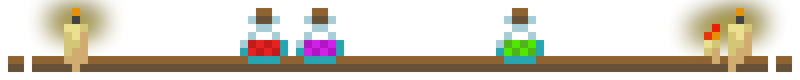

# Potions & Rituals

A Fabric mod that **enhance alchemy** in Minecraft.

New potions, effects, alchemical stones, imbued weapons, rituals, and immersive mechanics, expanding far beyond simple brewing.

This Mod is a rework of **The Alchemist's Touch**

## Overview

> The Alchemist is no longer just a potion brewer,  
> but a craftsman capable of **shaping matter, life, and death**.  
> Explore a complex potion system where every ingredient has meaning,  
> and your creations can change the world… literally.

### Main Features
- **55+ new potions** with new unique effects.
- **Alchemical Stones**: apply some effects to the **terrain**.
- New potions uses:
  - Mix up to 3 potions into a cauldron to get a multi-effect brew.
  - **Imbued Weapons**: apply a potion effect for a **number of hits**.
  - **Potion-infused food**: consume enchanted meals to gain effects.
  - **Stackable potions** up to 16 units.
- **Lava buckets** can fuel brewing stands (less efficient than blaze powder).
- New creation methods: **Rituals** (it's data-driven if you want to add some new ones).
- **Artifacts** that can do all sort of powerful things. Like the **Phoenix Quill** (A pretty op item): write and execute commands at the cost of health and xp 
(I don't really know how to balance it, but I really like it)
- 5 **In-game Book** to help you progress through the mod
- **Fully configurable** via YACL + ModMenu.

## ⚠️ SPOILERS ⚠️

<strong>Overview</strong>

## Potions

Every potion starts with an **Awkward Potion** unless stated otherwise.  
**Redstone** → extended duration.  
**Glowstone Dust** → increased potency.

### Vanilla Potions — Alternative Recipes

| Potion          | Alternative Ingredient                                             | Base         |
|-----------------|--------------------------------------------------------------------|--------------|
| Awkward         | Materia Prima                                                      | Water Bottle |
| Fire Resistance | Magma Block                                                        | Awkward      |
| Regeneration    | Golden Apple                                                       | Awkward      |
| Strength        | Firework Star                                                      | Awkward      |
| Poison          | - Poisonous Potato - Poisonous Carrot - Poisonous Beetroot | Awkward      |

### Mod main potions

| Potion               | Base                      | Ingredient             | Variant      |
|----------------------|---------------------------|------------------------|--------------|
| Saturation           | Awkward                   | Beetroot               | Long, Strong |
| Long Legs            | Awkward                   | Bamboo                 | Long         |
| Love                 | Awkward                   | Poppy                  | Long         |
| Liquid Walker        | Awkward                   | Lily Pad               | Long, Strong |
| Haste                | Awkward                   | Claw                   | Long, Strong |
| Mining Fatigue       | Haste                     | Fermented Spider Eye   | Long, Strong |
| Cold                 | Awkward                   | Snowball               | Long         |
| Frost                | Cold                      | Snowball               | Long         |
| Adhesion             | Awkward                   | Resin Clump            | Long         |
| Teleportation        | Awkward                   | Ender Pearl            | Strong       |
| Thorns               | Awkward                   | Cactus                 | Long, Strong |
| Purification         | Awkward                   | Milk Bucket            | Long         |
| Alcohol              | Awkward                   | Sweet Berries          | Long, Strong |
| Berserk              | Awkward                   | Torchflower            | Long, Strong |
| Giant                | Awkward                   | Bone Meal              | Long, Strong |
| Dwarfism             | Giant                     | Fermented Spider Eye   | Long, Strong |
| Photosynthesis       | Awkward                   | Leaf Litter            | Long, Strong |
| Magnetism            | Awkward                   | Iron Ingot             | Long, Strong |
| Ghost Walk           | Awkward                   | Ghast Tear             | Long         |
| Brain Washing        | Awkward                   | Zombie Brain           | Long         |
| Hands Bound          | Brain Washing             | Rabbit Foot            | Long         |
| Resurrection         | Awkward                   | Totem of Undying       | —            |
| Death                | Resurrection              | Wither Rose            | —            |
| Double Health        | Strong Healing            | Golden Apple           | Strong       |
| Ore Sense            | Night Vision              | Iron Ore               | Long, Strong |
| Glowing              | Night Vision              | Glow Berries           | Long         |
| Levitation           | Slow Falling              | Feather                | Long         |
| Darkness             | Awkward                   | Ink Sac                | Long         |
| Resonance            | Awkward                   | Echo Shard             | Long, Strong |
| Stun                 | Awkward                   | Charged Copper         | Long         |
| Rust                 | Awkward                   | Oxidation Fragment     | Long         |
| Short Cooldown       | Awkward                   | Sunflower              | Long         |
| Long Cooldown        | Short Cooldown            | Fermented Spider Eye   | Long         |
| Reactivation         | Short Cooldown            | Sunflower              | Strong       |
| XP Boost             | Awkward                   | Lapis Lazuli           | Long, Strong |
| XP Reduction         | XP Boost                  | Fermented Spider Eye   | Long, Strong |
| XP Life              | XP Boost                  | Glistering Melon Slice | Long         |
| Vampirism            | Awkward                   | Blood Bag              | Long, Strong |
| Alchemist            | Awkward                   | Mercury Ball           | —            |
| Midas Benediction    | Alchemist                 | Materia Prima          | Long         |
| Ignition             | Fire Resistance           | Fermented Spider Eye   | Long         |
| Acidity              | Poison                    | Rotten Flesh           | Long, Strong |
| Petrification        | Turtle Master             | Obsidian               | Long, Strong |
| Medusa Benediction   | Strong Petrification      | Materia Prima          | Long         |
| Zeus Benediction     | Stun                      | Materia Prima          | Long         |
| Active Teleportation | Teleportation             | Sulfur Ball            | Long         |
| Hydrophobia          | Water Breathing           | Fermented Spider Eye   | Long, Strong |
| Masking              | Invisibility              | Fermented Spider Eye   | —            |
| Oblivion             | Awkward                   | Pitcher Plant          | —            |
| Zombie Contagion     | Awkward                   | Rotten Flesh           | —            |
| Unstable             | *(not directly brewable)* | *(ritual / creative)*  | Strong       |
| Reality Check        | Awkward                   | Anvil                  | Long         |
| Clumsiness           | Alcohol                   | Fermented Spider Eye   | Long         |
| Asthma               | Awkward                   | Zombie Lung            | Long         |
| Paranoia             | Awkward                   | Creeper Head           | Long         |
| Infinity             | *(not directly brewable)* | *(ritual / creative)*  | —            |

### Permanent Elixirs

| Elixir             | Effect                    |
|--------------------|---------------------------|
| Permanent Health   | +1 max heart (permanent)  |
| Permanent Speed    | +base speed (permanent)   |
| Permanent Strength | +melee damage (permanent) |

## Effects Breakdown

| Effect               | Type       | Description                                                                                                                                                                    |
|----------------------|------------|--------------------------------------------------------------------------------------------------------------------------------------------------------------------------------|
| Long Legs            | Beneficial | Allows stepping up full blocks without jumping.                                                                                                                                |
| Liquid Walker        | Neutral    | Walk on water. A stronger version is required to walk on lava.                                                                                                                 |
| Ore Sense            | Beneficial | Grants an X-ray overlay highlighting nearby ores.                                                                                                                              |
| Resonance            | Neutral    | Transmits your active effects to nearby entities within a certain radius.                                                                                                      |
| Reactivation         | Beneficial | Adds extra time to all currently active effects.                                                                                                                               |
| Purification         | Beneficial | Instantly cleanses all negative effects without removing active bonuses.                                                                                                       |
| Petrification        | Harmful    | Completely immobilizes the entity but grants extreme damage resistance.                                                                                                        |
| Acidity              | Harmful    | Deals continuous damage to entities and melts weak blocks in the terrain.                                                                                                      |
| Ignition             | Harmful    | Sets the entity on fire and allows the player to throw fireballs on command. Smelts blocks when used on terrain.                                                               |
| Teleportation        | Neutral    | Teleports the entity randomly. The Strong version guarantees teleportation to the player's home/spawn point.                                                                   |
| Thorns               | Beneficial | Same as the enchantement, damage whoever attacked you.                                                                                                                         |
| Brain Washing        | Harmful    | Rallies undead mobs to attack your enemies, scrambles villager prices, and disorients the player.                                                                              |
| Frost                | Harmful    | Inflicts continuous cold damage, slows movement drastically, and freezes nearby water sources when used on terrain.                                                            |
| Alchemist            | Beneficial | Instantly transmutes coal/charcoal items into their gold variants.                                                                                                             |
| Death                | Harmful    | Inflicts massive, unavoidable damage that rapidly consumes health until death. Don't work to full efficiency on bosses.                                                        |
| Saturation           | Beneficial | Progressively restores the hunger and saturation bars over time.                                                                                                               |
| Double Health        | Beneficial | Instantly doubles max health with absorption hearts (these do not regenerate).                                                                                                 |
| Resurrection         | Beneficial | Acts as a Totem of Undying, cheating death and teleporting the player to an anchor point when used on terrain.                                                                 |
| Infinity             | Beneficial | Makes active effects permanent, but permanently reduces max health by 2 hearts per effect.                                                                                     |
| Short Cooldown       | Beneficial | Drastically reduces the cooldown times for potions and active abilities.                                                                                                       |
| Long Cooldown        | Harmful    | Drastically increases the cooldown times for potions and active abilities.                                                                                                     |
| Masking              | Neutral    | Hides visible potion effects on items and entities.                                                                                                                            |
| Unstable             | Harmful    | Grants random negative effects andd the entity have a high chance to explode.                                                                                                  |
| Vampirism            | Beneficial | Grants lifesteal on melee attacks, but causes the entity to burn in direct sunlight.                                                                                           |
| Stun                 | Harmful    | Briefly paralyzes the entity, preventing all actions.                                                                                                                          |
| Hands Bound          | Harmful    | Completely prevents breaking blocks, attacking entities, and interacting with blocks (e.g., chests).                                                                           |
| Aftermath            | Harmful    | Instantly kills the entity if their health is below 50% when the effect ends.                                                                                                  |
| Berserk              | Neutral    | Grants extreme speed, strength, and invulnerability. Applies the *Aftermath* effect when it ends.                                                                              |
| Ghost Walk           | Beneficial | Allows phasing through solid blocks, but drastically reduces the player's vision.                                                                                              |
| Giant                | Beneficial | Massively increases player size, reach, jump height, and speed, but makes you an easier target.                                                                                |
| Dwarfism             | Neutral    | Drastically reduces player size and reach, allowing you to sneak into tiny spaces.                                                                                             |
| Photosynthesis       | Beneficial | Gradually restores the hunger bar as long as the entity is in direct sunlight.                                                                                                 |
| Oblivion             | Harmful    | Randomly drop a portion (25%) of the entity's inventory.                                                                                                                       |
| Adhesion             | Beneficial | Allows the entity to stick to surfaces and climb vertical walls.                                                                                                               |
| Rust                 | Harmful    | Rapidly damages the durability of the affected entity's equipped armor.                                                                                                        |
| XP Boost             | Beneficial | Drastically increases the amount of experience gained from all sources.                                                                                                        |
| XP Reduction         | Harmful    | Drastically decreases the amount of experience gained from all sources.                                                                                                        |
| XP Life              | Neutral    | Replaces the standard health bar with the player's experience bar.                                                                                                             |
| Zeus Benediction     | Active     | Summons lightning strikes on melee targets or manually via keybind.                                                                                                            |
| Medusa Benediction   | Active     | Petrifies any entity that looks directly at you.                                                                                                                               |
| Active Teleportation | Active     | Instantly teleports the player to the exact block in their crosshair on command.                                                                                           |
| Pregnant             | Neutral    | Triggers a gestation period that eventually spawns baby mobs.                                                                                                                  |
| Love                 | Active     | Allows the player to breed any compatible species of animals instantly giving the affected entity the status effect Pregnant (Ear me out... not as weird as it seems... ok ?). |
| Midas Benediction    | Neutral    | Transforms the affected entity's equipped armors and weapons into their golden versions.                                                                                       |
| Cold                 | Harmful    | Causes random coughing and transmits the disease to nearby entities.                                                                                                           |
| Asthma               | Harmful    | Depletes the oxygen bar when running (even on land) and inflicts suffocation damage.                                                                                           |
| Clumsiness           | Harmful    | Forces the target to randomly drop the items they are holding.                                                                                                                 |
| Paranoia             | Harmful    | Causes the player to hear terrifying, fake monster sounds.                                                                                                                     |
| Hydrophobia          | Harmful    | Inflicts heavy, continuous damage when in contact with water or rain.                                                                                                          |
| Zombie Contagion     | Harmful    | Infects the entity, eventually transforming them into a zombie.                                                                                                                |
| Empathy              | Neutral    | Links the affected entity to its target, therefore, it receives a portion of the damage dealt.                                                                                 |
| Magnetism            | Neutral    | Attracts and sucks up all dropped items in a wide radius around the player.                                                                                                    |
| Reality Check        | Harmful    | Applies a movement slowdown based on how full/heavy the player's inventory is.                                                                                                 |

## Brewing Cauldron

- **Pour a potion (Splash and Lingering potion included)** into a vanilla cauldron so you can mix them together.
- **Extract**: 
  - right-click with a glass bottle to bottle the mixture back out.
  - right-click with arrows to create tipped arrows imbued with the cauldron's effects.
  - right-click with an Alchemical Stone to charge it from the cauldron's contents (must be a available alchemical stone).
- Be careful, if you make an unstable mixture or add an unstable potion to the cauldron, it will explode.

## Alchemical Stone

Items capable of **storing potion essences** and **applying the effect to the terrain**.

| Stone         | Effect on Terrain                                                                       |
|---------------|-----------------------------------------------------------------------------------------|
| Acidity       | Destroys weak blocks (hardness < 50) in a radius. Strong: larger radius, any hardness   |
| Petrification | Converts blocks to cobblestone (or sandstone for sand). Strong: converts to **bedrock** |
| Alchemist     | Transmutes coal blocks/ore into gold blocks/ore                                         |
| Ignition      | Smelts blocks like a furnace                                                            |
| Giant         | Grows crops to maturity                                                                 |
| Resurrection  | Grants Resurrection effect and sets teleport anchor point                               |
| Frost         | Freezes nearby water sources into ice in a radius. Strong: larger radius                |

## Imbued Weapons & Imbued Food

- **Weapon Imbuing**: Combine a weapon with a potion in a Crafting Table. Each hit delivers the effect for a number of hits based on the potion's duration (minimum 10 hits).
- **Food Imbuing**: Combine any food item with one or more potions in a Crafting Table. Eating applies all imbued effects.

## Rituals

Rituals are **data-driven transmutations** — patterns of blocks and pedestals that reshape reality when triggered.

Each ritual defines:
- A **pattern grid** of blocks and pedestal items
- A **catalyst** (kill a specific entity nearby, or ignite a charge)
- Optional **conditions** (biome, time, weather, moon phase, health, XP, dimension, height, brightness, effects, offhand item)
- **During-actions** (particles, effects while the ritual runs)
- A **result** (spawn items/blocks/entities, run custom actions)

| Ritual         | Catalyst               | Pattern                           | Result                                          |
|----------------|------------------------|-----------------------------------|-------------------------------------------------|
| Skeleton Horse | Kill a skeleton horse  | Blood Trail + Bones               | Spawns a skeletal steed                         |
| Ancient Debris | Ignite                 | Blood Trail + Diamond Blocks      | Spawns ancient debris                           |
| Random Effect  | Ignite                 | Single Potion on pedestal         | Gives a random effect                           |
| Thunderstorm   | Ignite                 | Water Buckets + Iron Block        | Summons a thunderstorm                          |
| Echo Shard     | Kill, night + new moon | Amethyst Shards + Blood Trail     | Spawns echo shards                              |
| Summon Dawn    | Ignite                 | Glowstone Dust + Sunflower        | Sets time to dawn                               |
| Nether Gate    | Kill in Overworld      | Blood Trail pattern               | Teleports player to Nether with Ghost Walk      |
| Seal Nether    | Ignite                 | Blood Trail + Nether Seal Breaker | Seals the Nether permanently (world attachment) |
| Phoenix Quill  | Ignite                 | Nether Star + Resurrection Potion | Craft a Phoenix Quill (low HP, night, thunder)  |

> Pattern will be shown in-game with a book

## Alchemical Tomes

Five in-game books with custom GUI, recipes, lore, and illustrations - no wiki required:
1. **Magnus Opus: The Foundations of Alchemy** - introduction to the four stages
2. **Nigredo: Chronicles of Chaos** - all custom potion recipes
3. **Albedo: Vessel of Order** - talismans, artifacts, Alchemical Stones
4. **Citrinitas: Anchor of Enlightenment** - ritual documentation
5. **Rubedo: Apex of Mastery** - grand rituals

## Special Items

| Item                    | Description                                                                                     | Obtain methods                               |
|-------------------------|-------------------------------------------------------------------------------------------------|----------------------------------------------|
| Materia Prima           | Enchanted base alchemical component (substitute for Nether Wart)                                | Craft                                        |
| Sulfur / Mercury / Salt | Primal Principles, smelted from raw materials                                                   | Smelt                                        |
| Claw                    | Ingredient                                                                                      | Drop (Cat, Wolf, Ocelot)                     |
| Bat Wing                | Ingredient                                                                                      | Drop (Bat)                                   |
| Zombie Brain            | Ingredient + edible (grants Brain Washing)                                                      | Drop (Zombie, Zombie Villager, Husk)         |
| Zombie Lung             | Ingredient + edible (grants Asthma)                                                             | Drop (Zombie, Zombie Villager, Husk)         |
| Witch's Finger          | Ingredient                                                                                      | Drop (Witch)                                 |
| Syringe                 | Extract/inject potion effects from/to entities; if no potions effect is found, give a blood bag | Craft                                        |
| Blood Bag               | Stores blood, places Blood Trail blocks                                                         | Syringe use                                  |
| Charged Copper          | Ingredient                                                                                      | Spawn when lightning strikes a lightning rod |
| Oxidation Fragment      | Ingredient + oxidize copper                                                                     | Using an axe on an oxidized copper block     |

## Artifacts

| Artifacts                | Description                                                                                                            |
|--------------------------|------------------------------------------------------------------------------------------------------------------------|
| Empty Talisman           | Base for charged talisman                                                                                              |
| Charged Talisman         | Overflowing with soul energy                                                                                           |
| Alchemical Bag           | Give you access to a pocket dimension where you can store anything                                                     |
| Portal Seal Breaker      | Break the nether portal seal and builds a Nether portal                                                                |
| Spirit Mirror            | Teleports to the Spirit Dimension (6 uses)                                                                             |
| Decoy                    | Distracts hostile mobs                                                                                                 |
| Gauntlet of the Absolute | Stores up to 5 alchemical stone effects; cycle & apply on terrain                                                      |
| Invisibility Ring        | Grants invisibility while held                                                                                         |
| Invisibility Cloak       | Wearable chestplate granting invisibility +2 armor                                                                     |
| Phoenix Quill            | Write and execute any command at the cost of your health and xp (still pretty op if you know what you are doing)       |
| Lock                     | Locks any chest or container (people might still steal your stuff as the container just gets 10 times harder to break) |
| Key                      | Unlocks a matching locked container (consumed on use)                                                                  |
| Capture Sphere           | Thrown projectile that captures mobs inside or releases them                                                           |

## Keybinds

| Keybind                        | Default  | Function                                         |
|--------------------------------|----------|--------------------------------------------------|
| Active Effect / Cycle Gauntlet | Left Alt | Trigger active effects or cycle Gauntlet effects |
| Show Effect Icons              | M        | Hold to display active effect icons overlay      |

## Configurable

- **[ModMenu](https://modrinth.com/mod/modmenu)** + **[YACL](https://modrinth.com/mod/yacl)** integration
- 3 tabs: Potions & Items, Mob Effects, Active Effects
- Tweak every number: durations, cooldowns, strengths, ranges, colors
- Runtime blacklists for effects, potions, and alchemical stones

**Potions & Rituals** is built for **Minecraft 26.2** with **Fabric**. It requires [Fabric API](https://modrinth.com/mod/fabric-api).

*Alchemy isn't just a craft. It's a transformation.*

## Got feedback or ideas?

- Email: [matibi.mods@gmail.com](mailto:matibi.mods@gmail.com)